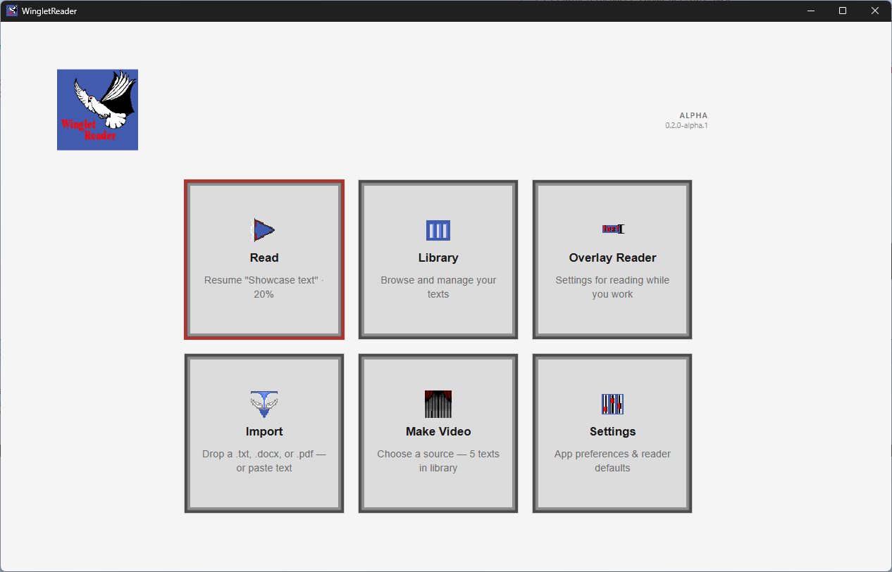
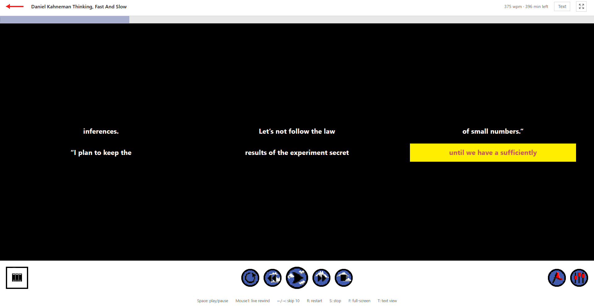
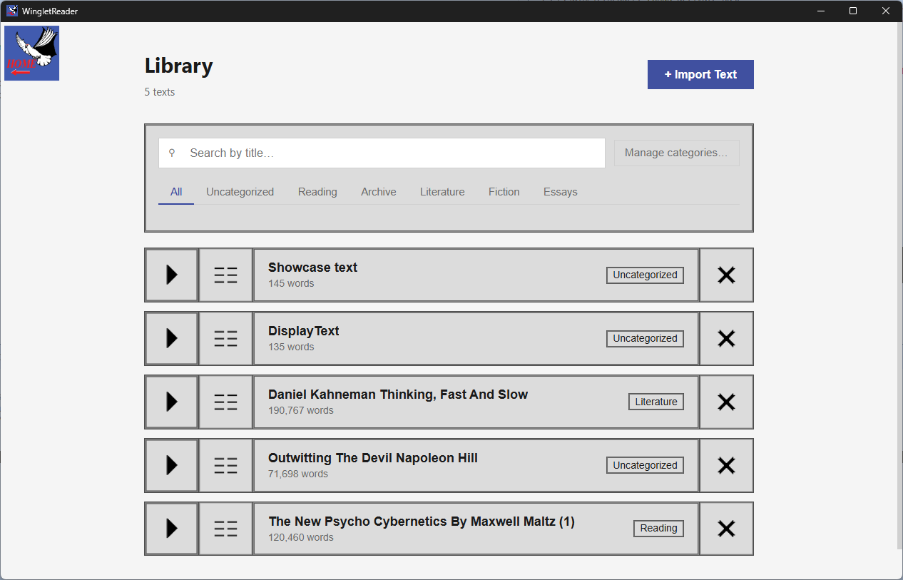
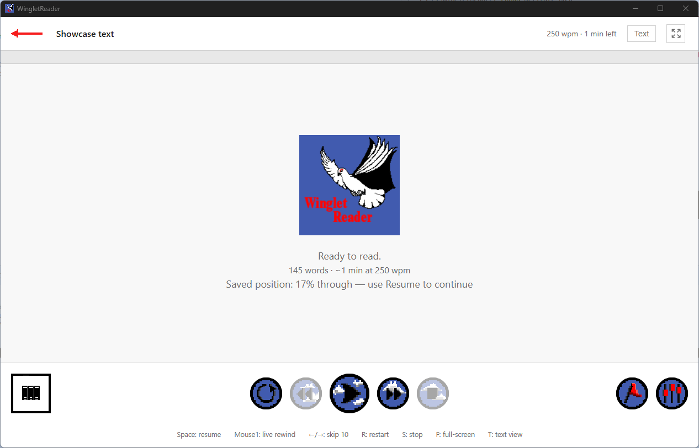

<div align="center">

# WingletReader

**A local-first desktop speed-reading application.**
Turn any text into a rhythmic, adjustable word-stream — and keep every byte of your library on your own machine.

`Electron` · `React` · `TypeScript` · **Early alpha — v0.2.0-alpha.1**

<picture>
  <source media="(prefers-color-scheme: dark)" srcset="docs/screenshots/hub-dark.png">
  
</picture>

</div>

---

> **About this repository.** WingletReader is a real product in active alpha,
> built **in public**. This repo is where you read the source, the architecture,
> and the [decision records](docs/adr) — it is **source-available for evaluation,
> not open source** (see [LICENSE](LICENSE)). End users
> **[download a packaged build](#download)** rather than cloning. Feedback is
> welcome; routing is at the [bottom](#community--feedback).

## Download

WingletReader ships as a **Windows installer**.

### ➜ [**Download the latest release**](https://github.com/winglet-stack/WingletReader-Releases/releases/latest)

The app auto-updates from then on, checking for new alpha builds on startup.

> **The Windows SmartScreen warning is expected.** Alpha builds aren't
> code-signed yet, so Windows may show a *"Windows protected your PC"* screen on
> first run. Click **More info → Run anyway** — the warning is about the unsigned
> installer, not anything wrong with it. Code signing is planned for beta. Prefer
> to build from source? See [Build & run](#build--run).

## What it does

WingletReader displays text as a controlled stream of small word groups shown in
rhythm, instead of a static page you scan line by line. You set the pace and
shape of the stream — how fast, how many words at a time, how many lines, what
colours — to strip out the friction that slows ordinary reading: back-tracking,
wandering attention, and an uneven pace. Everything lives on your device: no
account, no cloud sync, no telemetry.

The core display unit is a **Stack** — a fixed number of words shown together for
one beat of a tempo. The Reader advances exactly one Stack per beat, so speed is
governed by two dials you control:

```
WPM  =  BPM  ×  words per stack
```

**BPM** sets the tempo (one Stack per beat); **words per stack** sets how much
text each beat carries. So 300 BPM at 2 words per stack reads at 600 WPM. The
stream also breathes — sentence, paragraph, and heading boundaries get slightly
longer holds — so the rhythm tracks the structure of the writing rather than
marching flatly.

It's an experimental practice tool with no proven results to cite, not a
replacement for reading the traditional way — built on widely-taught reading and
speed-reading principles to help you notice involuntary regression, try different
reading styles, and read with a steadier rhythm.

<div align="center">



*Playback in progress — multiple Stacks visible at once, active group highlighted.*

</div>

## Screenshots

<div align="center">

<sub><em>WingletReader ships light and dark — the shots below follow your GitHub theme.</em></sub>

<table>
<tr>
<td width="50%" align="center" valign="top">
  <picture>
    <source media="(prefers-color-scheme: dark)" srcset="docs/screenshots/library-dark.png">
    
  </picture>
  <br>
  <sub><b>Library</b> — your texts, sorted into categories, searchable.</sub>
</td>
<td width="50%" align="center" valign="top">
  <picture>
    <source media="(prefers-color-scheme: dark)" srcset="docs/screenshots/reader-idle-dark.png">
    
  </picture>
  <br>
  <sub><b>Reader</b> — a session ready to go, saved position remembered.</sub>
</td>
</tr>
</table>

</div>

## Features

### 📖 Reader

The adaptive playback display. Break any text into Stacks and read in rhythm,
with live control over speed (BPM), words per stack, on-screen Stacks and lines,
colours, highlight style, and an optional metronome click. Set **reading targets**
to structure a session, drop **bookmarks** to jump back to spots, and flip to a
paged, paragraph-aware **plain-text view** with a keystroke. Input bindings
(advance key, live-rewind, tap-to-read) are configurable.

### 🪟 Overlay Reader

Reading while you work. Select a block of text anywhere, press your shortcut, and
it streams the passage in a small always-on-top window using your Reader
settings — then steps out of the way until triggered again. A draggable standby
pill (and a tray control in packaged builds) shows when it's armed.

### 🎬 Make Video

Export a text with your Reader settings applied as an **MP4**, so you can watch
the playback on a device that can't run the app. Pick a saved text, or
paste/upload something new without adding it to your library.

### 📚 Library

Store and manage the texts you're reading: sort them into your own **categories**,
browse and search, append new **content** to a text you're working through
chapter by chapter, and discard texts when you're done.

### 📥 Import

Bring text in by **uploading a file** (`.txt`, `.docx`, `.pdf`) or **pasting**
from the clipboard. Imported text is normalised on the way in (bullet/line
classification, dash handling) so the stream reads cleanly.

### ⚙️ Settings

A flat, auto-saving preferences surface: Appearance, Reader defaults (a full
editor for playback, grid, text, colours, and spacing), Overlay Reader, Import,
and Data (export/import your whole library to JSON). Saveable **Profiles** and
colour **Palettes** keep configurations you like.

> *Reader controls are shown in-app and configurable. Defaults:* `Space`
> *play/pause,* `←/→` *skip,* `R` *restart,* `S` *stop,* `F` *full-screen,*
> `T` *text view,* `Mouse1` *live-rewind.*

## Engineering highlights

- **Local-first by design (ADR-0007).** No user data leaves the device. The only
  network traffic in a packaged build is a single startup update check against a
  public releases repo; dev and portable builds skip even that. No analytics, no
  crash reporting, no phone-home.
- **A pure JSON file store, not a database (ADR-0001).** All data is one
  atomic-write JSON file in the OS user-data directory — no SQLite, no native
  compilation step, trivially portable and inspectable.
- **A layout fit-solver, not a fixed stage.** The Reader sizes the word grid to
  the viewport with a pure solver that degrades gracefully (font → spacing → line
  count) so dense grids never clip off-screen, re-solving when fonts finish
  loading.
- **Off-thread tokenization.** Turning a whole book into Stacks runs in a
  dedicated Web Worker with a deterministic synchronous fallback, so the engage
  frame stays responsive on large texts.
- **Portable USB mode (ADR-0016).** A marker file beside the executable redirects
  all storage next to the app, so the whole library travels on a stick.
- **Frozen back-compat identifiers.** A handful of legacy `fasttrack` identifiers
  (the data filename, app id, storage keys) are deliberately *frozen* so existing
  users' data never orphans — documented as invariants in [`CONTEXT.md`](CONTEXT.md).
- **Decisions are recorded.** [31 Architecture Decision Records](docs/adr) trace
  the reasoning behind the data layer, the settings model, the hub, the design
  system, bookmarks, the session model, and more.
- **A real design system, and tested.** One vanilla `index.css`, role-based
  colour, and hand-drawn pixel-art sprites ([`docs/design-system.md`](docs/design-system.md));
  94 Vitest files, including a normalization conformance corpus for the import
  pipeline.

## Architecture

Three process layers, wired the standard Electron way:

```
Main (Node / Electron)
  ├── database.ts            JSON file store (texts, settings, segments, bookmarks)
  ├── fileParser.ts          .txt / .docx / .pdf → plain text + blocks
  ├── importTextCleanup.ts   Post-import normalisation
  ├── readWhileWorkingCore   Overlay Reader window + tray + capture
  ├── updater.ts             Packaged-build auto-update check
  ├── portableMode.ts        USB / run-in-place storage redirect
  └── index.ts               Window management + app lifecycle
Preload
  └── contextBridge          Typed window.api exposed to the renderer
Renderer (React)
  ├── App / AppShell          Composition root + app body
  ├── contexts/               Navigation → Settings → Library → Reader providers
  ├── components/             Hub, Reader, Library, Transmute, Overlay, Settings…
  ├── engine/                 Pure logic: tokenizer, segmenter, layout solver, …
  └── hooks/                  usePlayback (timer engine), useMetronome, …
```

Outside the Library context, code mutates shared state only through a small,
deliberate surface. File-level map:
[`docs/architecture-map.md`](docs/architecture-map.md); domain vocabulary and
invariants: [`CONTEXT.md`](CONTEXT.md).

## Technology

| Layer | Choice |
|---|---|
| Desktop shell | Electron 43 |
| Build tooling | electron-vite 2 |
| UI | React 18 + TypeScript 5 |
| State | React Context (no external state library — ADR-0003) |
| Data store | JSON file, atomic writes (ADR-0001) |
| `.docx` / `.pdf` parsing | mammoth / pdf-parse |
| Video export | mp4-muxer |
| Audio (metronome) | Web Audio API |
| Styling | One vanilla `index.css`, CSS custom properties, light/dark |
| Packaging | electron-builder (NSIS installer) + electron-updater |
| Tests | Vitest + Testing Library |

No native compilation required.

## Privacy & data

- All data is a single JSON file, `fasttrack-data.json`, in the OS user-data
  directory (on Windows, typically `%APPDATA%\wingletreader\`). The `fasttrack`
  name is a frozen legacy identifier kept for back-compat — see
  [`CONTEXT.md`](CONTEXT.md).
- **Export / Import** (Settings → Data) writes or merges your whole library as
  portable JSON, so your data is always yours to move.

## Build & run

**Prerequisites:** Node.js 24 (pinned in [`.nvmrc`](.nvmrc); `nvm use` selects
it) and the npm 11 that ships with it. No native toolchain needed.

```bash
nvm use            # select the pinned Node 24 (reads .nvmrc)
npm ci             # install exact locked dependencies (reproducible)

npm run dev        # run the app with hot reload (electron-vite)
npm run build      # production build
npm test           # run the Vitest suite

npm run dist:win       # build a Windows NSIS installer
npm run dist:portable  # build a portable (run-in-place) copy
```

Full reproducible-build rationale and the one-command installer flow:
[docs/BUILD.md](docs/BUILD.md).

## Project structure

```
README.md
LICENSE            Source-available terms (evaluation, not open source)
CONTRIBUTING.md    Where ideas/bugs go; PRs closed for alpha
SECURITY.md        Private vulnerability disclosure + runtime posture
CODE_OF_CONDUCT.md Contributor Covenant
ROADMAP.md         Public Now / Next / Later roadmap
CONTEXT.md         Domain glossary, invariants, and tombstones
docs/              ADRs, design system, architecture map, screenshots
design/            Design-reference art + source files
resources/         Shipped app resources (icon, splash, seed library)
src/               Electron main · preload · shared · renderer (React)
```

## Community & feedback

WingletReader is built **in public**, and feedback from real use is the most
useful thing you can give during alpha:

- **💡 Ideas → [Discussions](https://github.com/winglet-stack/WingletReader/discussions/categories/ideas)** — features, "it'd be nice if…", questions about how it works.
- **🐛 Bugs → [Issues](https://github.com/winglet-stack/WingletReader/issues/new/choose)** — the template asks for version, OS, steps, and the log path.
- **🔒 Security → [SECURITY.md](SECURITY.md)** — report privately, never as a public issue.

**Code pull requests are not accepted during alpha** (source-available license,
churning codebase — they'll open deliberately later). Detail in
[CONTRIBUTING.md](CONTRIBUTING.md); community expectations in
[CODE_OF_CONDUCT.md](CODE_OF_CONDUCT.md).

## Status & roadmap

WingletReader is in **early alpha**; the living roadmap (Now / Next / Later) lives
in [ROADMAP.md](ROADMAP.md).

| Area | State |
|---|---|
| Standard Reader | ✅ Active |
| Library, categories, contents | ✅ Active |
| Import (`.txt` / `.docx` / `.pdf` / paste) | ✅ Active |
| Bookmarks & reading **Targets** | ✅ Shipped |
| Make Video (MP4 export) | ✅ Active |
| Portable USB mode | ✅ Shipped |
| Windows installer + auto-update | ✅ Shipped |
| Overlay Reader  | 🚧 Active, in development |
| Post-reading summary flow | 🔒 Built, disabled for alpha v1 |
| In-app feedback sender | ⏳ Planned |
| Curated pre-formatted book bundle | ⏳ Planned |

## License

Source-available for portfolio review and personal study — **not** open source.
Redistribution, derivative works, and commercial or non-commercial reuse require
written permission. See [LICENSE](LICENSE).

© 2026 Florian. The WingletReader name, logo, and dove mark are reserved.
