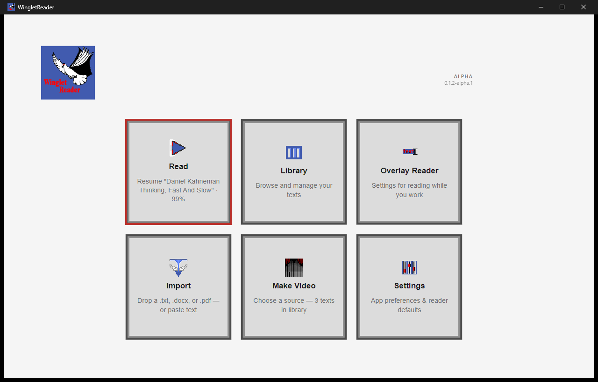
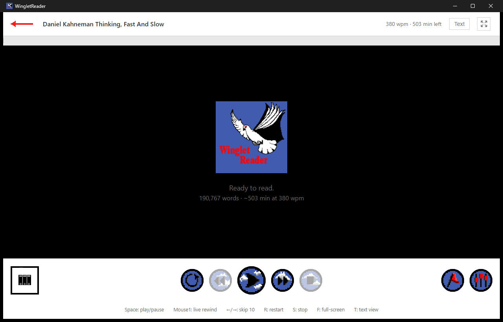
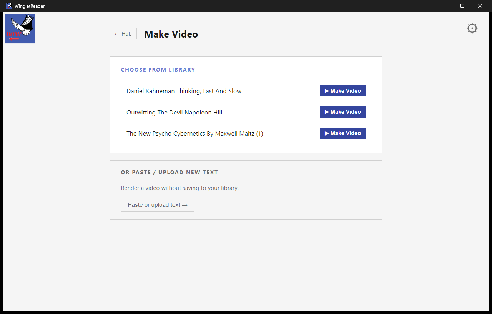
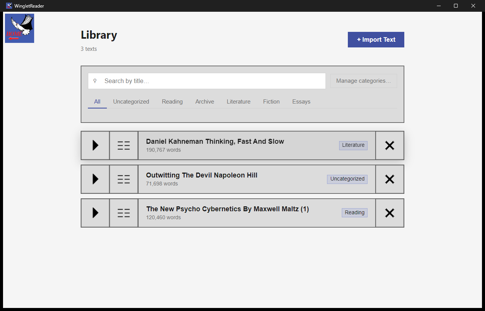
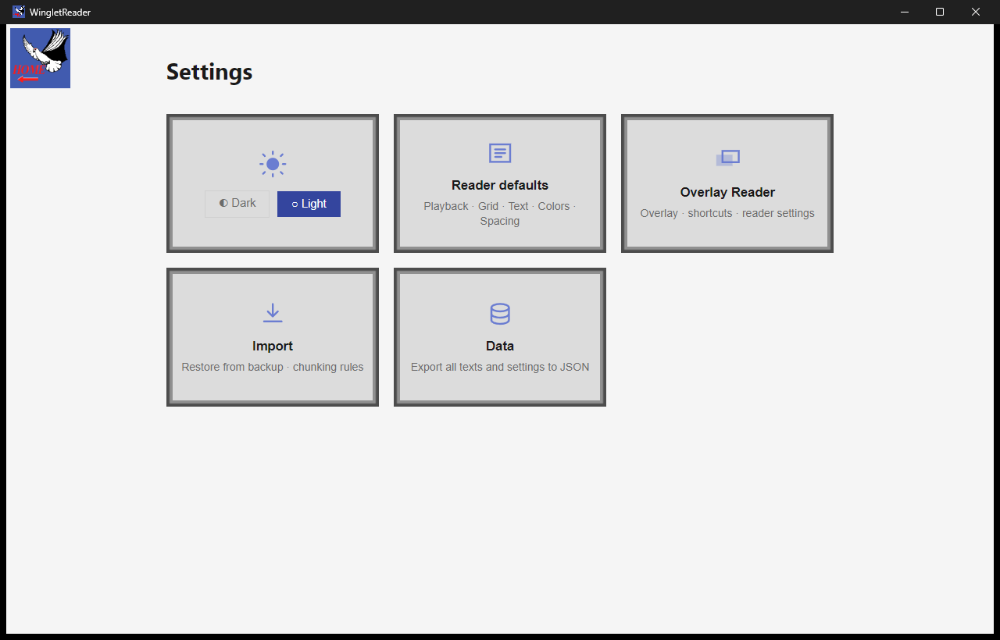

<div align="center">

# WingletReader

**A local-first desktop speed-reading application.**
Read faster by turning any text into a rhythmic, adjustable word-stream — and keep every byte of your library on your own machine.

`Electron` · `React` · `TypeScript` · **Early alpha — v0.2.0-alpha.1**



</div>

---

> **About this repository.** WingletReader is a real software product, in active
> alpha development, built **in public**. This repository is where you can read
> the source, the architecture, the [27 decision records](docs/adr), and the
> design work — and where the project gathers feedback: **ideas go to
> [Discussions](https://github.com/winglet-stack/WingletReader/discussions),
> bugs go to [Issues](https://github.com/winglet-stack/WingletReader/issues)**.
> The code is source-available for evaluation, not open-source, and **code PRs
> are not accepted during alpha** — see the [LICENSE](LICENSE) and
> [CONTRIBUTING.md](CONTRIBUTING.md). End users **[download](#download)** a
> packaged build rather than cloning this repo.

---

## Contents

- [Download](#download)
- [What it does](#what-it-does)
- [How the reading model works](#how-the-reading-model-works)
- [Features](#features)
- [Philosophy & honest caveats](#philosophy--honest-caveats)
- [Engineering highlights](#engineering-highlights)
- [Architecture](#architecture)
- [Technology](#technology)
- [Privacy & data](#privacy--data)
- [Build & run](#build--run)
- [Project structure](#project-structure)
- [Community & feedback](#community--feedback)
- [Status & roadmap](#status--roadmap)
- [License](#license)

---

## Download

WingletReader ships as a **Windows installer**. Grab the latest alpha from the
releases repo:

### ➜ [**Download the latest release**](https://github.com/winglet-stack/WingletReader-Releases/releases/latest)

Run the installer and the app updates itself from then on (it checks for new
alpha builds on startup).

> **Windows SmartScreen warning — this is expected.** Alpha builds are **not yet
> code-signed**, so on first run Windows may show a blue *"Windows protected your
> PC"* screen. To install anyway:
>
> 1. Click **More info**.
> 2. Click **Run anyway**.
>
> The warning appears because the installer is unsigned, not because anything is
> wrong with it. Code signing is planned for beta. If you'd rather build from
> source instead, see [Build & run](#build--run).

---

## What it does

WingletReader displays a text as a controlled stream of small word groups shown
in rhythm, instead of a static page you scan line by line. You set the pace and
the shape of the stream — how fast, how many words at a time, how many lines,
what colours — and read along. The idea is to remove the friction that slows
ordinary reading: back-tracking, wandering attention, and an uneven pace.

Everything lives on your device. There is no account, no cloud sync, and no
telemetry.

<div align="center">



*The Reader, ready to resume a saved book. Progress and estimated time are shown up top; the transport and key hints sit at the bottom.*

</div>

---

## How the reading model works

The core display unit is a **Stack** — a fixed number of words shown together for
one beat of a tempo. The Reader advances exactly one Stack per beat, so speed is
governed by two dials you control:

```
WPM  =  BPM  ×  words per stack
```

- **BPM** (beats per minute) sets the tempo — one Stack per beat.
- **Words per stack** sets how much text each beat carries.

So 300 BPM at 2 words per stack reads at 600 WPM. The stream also breathes:
sentence, paragraph, and heading boundaries get slightly longer holds, so the
rhythm tracks the structure of the writing rather than marching flatly.

<div align="center">


*Design board: the active word group is emphasised beat-by-beat across a three-word Stack.*


*Playback in progress — multiple Stacks visible at once, with the active group highlighted.*

</div>

---

## Features

### 📖 Reader

The adaptive playback display. Break any text into Stacks and read it in rhythm,
with live controls to tune:

- **Playback speed** (BPM) and **words per stack**
- **Number of Stacks** shown on screen and **number of lines**
- **Colours** of text, background, and the active-word highlight
- **Highlighting** style and an optional metronome click (Web Audio)

You can browse the full text, set **reading targets** to structure a session
(the Reader stops and offers next steps when you reach one), and drop
**bookmarks** to save interesting spots and jump back to them later. A paged,
paragraph-aware **plain-text view** is a keystroke away when you want to read a
passage normally. Input bindings (advance key, live-rewind, tap-to-read) are
configurable.

### 🪟 Overlay Reader *(active, in development)*

Reading while you work. The Overlay Reader runs quietly in the background; when a
long block of text crosses your path, select it, press your shortcut, and it
streams the passage in a small always-on-top window using your Reader settings.
When it finishes it steps out of the way and waits to be triggered again. A
draggable standby pill (and a tray control in packaged builds) shows when it's
armed.

### 🎬 Make Video

Turn a book into a video. **Make Video** exports a text with your Reader settings
applied as an MP4 file — so you can watch the playback on a device that can't run
the app, or read on the go. Pick a saved text, or paste/upload something new
without adding it to your library.

<div align="center">



</div>

### 📚 Library

Store and manage the texts you're reading. Sort them into your own
**categories**, browse and search, append new **content** to a text you're
working through chapter by chapter, and discard texts when you're done.

<div align="center">



</div>

### 📥 Import

Bring in text your way:

- **Upload a file** — `.txt`, `.docx`, or `.pdf`
- **Paste** straight from your clipboard

Imported text is normalised on the way in (bullet/line classification, dash
handling) so the stream reads cleanly. Curated, pre-formatted books are planned.

### ⚙️ Settings

A flat, auto-saving preferences surface: Appearance (light/dark), Reader defaults
(a full two-tab editor for playback, grid, text, colours, and spacing), Overlay
Reader configuration, Import rules, and Data (export/import your whole library to
JSON). Saveable **Profiles** and colour **Palettes** let you keep configurations
you like.

<div align="center">



</div>

> *Note: keyboard/mouse controls in the Reader are shown in-app and are
> configurable. Defaults include* `Space` *play/pause,* `←/→` *skip,* `R` *restart,*
> `S` *stop,* `F` *full-screen,* `T` *text view, and* `Mouse1` *live-rewind.*

---

## Philosophy & honest caveats

WingletReader is deliberately upfront about what it is and isn't:

- **An alternative format is not automatically a better one.** WingletReader is
  not meant to replace reading physical books the traditional way.
- **It is an experimental tool.** This specific mechanism has no proven results to
  cite. What it *does* build on are widely-taught reading and speed-reading
  principles.
- **The real goal is three reading habits** that inattention tends to erode:
  - **Avoiding regression** — the involuntary back-tracking most of us do while
    reading. A continuous stream makes you *actively* interrupt to go back,
    turning a subconscious habit into a conscious choice that's easier to notice
    and address.
  - **Trying different reading styles** — RSVP-style single words, or chunked
    groups — so you can experiment and find what actually suits you.
  - **Reading with rhythm** — a steady pace can support comprehension and recall.

Experiment, find what suits you, and treat it as a practice tool rather than a
silver bullet.

---

## Engineering highlights

The parts of the build worth a closer look:

- **Local-first by design (ADR-0007).** No user data leaves the device. The only
  network traffic in a packaged build is a single startup update check against a
  public releases repo; dev and portable builds skip even that. No analytics, no
  crash reporting, no feedback phone-home.
- **A pure JSON file store, not a database (ADR-0001).** All data is one
  atomic-write JSON file in the OS user-data directory — no SQLite, no native
  compilation step, trivially portable and inspectable. The decision (and its
  trade-offs) is written up as an ADR.
- **A layout fit-solver, not a fixed stage.** The Reader sizes the word grid to
  the viewport with a pure solver that degrades gracefully (font → spacing → line
  count) so dense grids never clip off-screen, re-solving when fonts finish
  loading.
- **Off-thread tokenization.** Turning a whole book into Stacks is CPU-bound, so
  it runs in a dedicated Web Worker with a deterministic synchronous fallback —
  the engage frame stays responsive on large texts.
- **Portable USB mode (ADR-0016).** A marker file beside the executable redirects
  all storage next to the app, so the whole library travels on a stick.
- **Back-compat discipline.** A handful of legacy `fasttrack` identifiers (the
  data filename, app id, storage keys) are deliberately *frozen* so existing
  users' data never orphans — documented as invariants in
  [`CONTEXT.md`](CONTEXT.md).
- **Decisions are recorded.** [27 Architecture Decision Records](docs/adr) trace
  the reasoning behind the data layer, the settings model, the hub, the design
  system, bookmarks, the session model, and more.
- **A real design system.** One vanilla `index.css`, a device-console visual
  identity, role-based colour, and hand-drawn pixel-art sprites — documented in
  [`docs/design-system.md`](docs/design-system.md), with the source art viewable
  under [`design/`](design).
- **Tested.** ~90 test files run under Vitest, including a normalization
  conformance corpus for the import pipeline.

---

## Architecture

Three process layers, wired the standard Electron way:

```
Main process (Node / Electron)
  ├── database.ts            JSON file store (texts, settings, segments, bookmarks)
  ├── fileParser.ts          .txt / .docx / .pdf → plain text + blocks
  ├── importTextCleanup.ts   Post-import normalisation
  ├── readWhileWorkingCore   Overlay Reader window + tray + capture
  ├── updater.ts             Packaged-build auto-update check
  ├── portableMode.ts        USB / run-in-place storage redirect
  └── index.ts               Window management + app lifecycle

Preload
  └── contextBridge          Exposes a typed window.api to the renderer

Renderer (React)
  ├── App.tsx / AppShell.tsx  Composition root + app body
  ├── contexts/               Navigation → Settings → Library → Reader providers
  ├── components/             Hub, Reader, Library, Transmute, Overlay, Settings…
  ├── engine/                 Pure logic: tokenizer, segmenter, layout solver,
  │                           palettes, pagination, video renderer, bindings
  └── hooks/                  usePlayback (timer engine), useMetronome, …
```

The renderer is organised as a provider tree; outside the Library context, code
mutates shared state only through a small, deliberate surface. A file-level map
lives in [`docs/architecture-map.md`](docs/architecture-map.md); domain
vocabulary and invariants live in [`CONTEXT.md`](CONTEXT.md).

---

## Technology

| Layer | Choice |
|---|---|
| Desktop shell | Electron 28 |
| Build tooling | electron-vite 2 |
| UI | React 18 + TypeScript 5 |
| State | React Context (no external state library — ADR-0003) |
| Data store | JSON file store, atomic writes (ADR-0001) |
| `.docx` parsing | mammoth |
| `.pdf` parsing | pdf-parse |
| Video export | mp4-muxer |
| Audio (metronome) | Web Audio API |
| Styling | One vanilla `index.css`, CSS custom properties, light/dark |
| Packaging | electron-builder (NSIS installer) + electron-updater |
| Tests | Vitest + Testing Library |

No native compilation required.

---

## Privacy & data

- **Nothing leaves your device** except one optional startup update check in
  packaged builds (ADR-0007). No accounts, telemetry, analytics, or crash
  reporting.
- All data is a single JSON file, `fasttrack-data.json`, in the OS user-data
  directory (on Windows, typically `%APPDATA%\wingletreader\`). The
  `fasttrack` name is a frozen legacy identifier kept for back-compat — see
  [`CONTEXT.md`](CONTEXT.md).
- **Export / Import** (Settings → Data) writes or merges your whole library as
  portable JSON, so your data is always yours to move.

---

## Build & run

**Prerequisites:** Node.js 24 (pinned in [`.nvmrc`](.nvmrc); `nvm use` selects
it) and the npm 11 that ships with it. No native toolchain needed.

```bash
nvm use            # select the pinned Node 24 (reads .nvmrc)
npm ci             # install exact locked dependencies (reproducible)

npm run dev        # run the app with hot reload (electron-vite)
npm run build      # production build
npm test           # run the Vitest suite

npm run dist:win       # build a Windows NSIS installer
npm run dist:portable  # build a portable (run-in-place) copy
```

For the full reproducible-build rationale and the one-command installer flow,
see [docs/BUILD.md](docs/BUILD.md).

---

## Project structure

```
WingletReader/
├── README.md
├── LICENSE                Source-available terms (portfolio/evaluation)
├── CONTRIBUTING.md        Where ideas/bugs go; PRs closed for alpha
├── SECURITY.md            Private vulnerability disclosure + runtime posture
├── CODE_OF_CONDUCT.md     Contributor Covenant
├── ROADMAP.md             Public Now / Next / Later roadmap
├── CONTEXT.md             Domain glossary, invariants, and tombstones
├── .github/               Issue templates + CI/release workflows
├── package.json
├── electron.vite.config.ts
├── docs/
│   ├── adr/               27 Architecture Decision Records
│   ├── design-system.md   Visual language reference
│   ├── architecture-map.md
│   ├── dev/               Import-normalisation test corpus
│   └── screenshots/       Images used in this README
├── design/                Design-reference art + source files (see design/README.md)
├── resources/             Shipped app resources (icon, splash, seed library)
└── src/
    ├── main/              Electron main process
    ├── preload/           contextBridge
    ├── shared/            Cross-process utilities
    └── renderer/src/      React app (components, engine, hooks, contexts)
```

---

## Community & feedback

WingletReader is built **in public**, and feedback from real use is the most
useful thing you can give during alpha:

- **💡 Ideas & recommendations →
  [Discussions](https://github.com/winglet-stack/WingletReader/discussions/categories/ideas)** —
  features, "it'd be nice if…", questions about how it works.
- **🐛 Bugs →
  [Issues](https://github.com/winglet-stack/WingletReader/issues/new/choose)** —
  something broken or wrong. The template asks for version, OS, steps, and the
  log path.
- **🔒 Security →
  [SECURITY.md](SECURITY.md)** — report privately, never as a public issue.

**Code pull requests are not accepted during alpha** (source-available license,
churning codebase — they'll open deliberately later). Full detail in
[CONTRIBUTING.md](CONTRIBUTING.md); community expectations in
[CODE_OF_CONDUCT.md](CODE_OF_CONDUCT.md).

---

## Status & roadmap

WingletReader is in **early alpha**. The living roadmap (Now / Next / Later)
lives in [ROADMAP.md](ROADMAP.md). Core reading, the library,
Make Video, import, bookmarks/targets, the session model, and portable mode are
implemented and in daily use. Honest status of the moving parts:

| Area | State |
|---|---|
| Standard Reader | ✅ Active |
| Library, categories, contents | ✅ Active |
| Import (`.txt` / `.docx` / `.pdf` / paste) | ✅ Active |
| Bookmarks & reading **Targets** | ✅ Shipped |
| Make Video (MP4 export) | ✅ Active |
| Portable USB mode | ✅ Shipped |
| Windows installer + auto-update | ✅ Shipped |
| Overlay Reader (read-while-working) | 🚧 Active, in development |
| Post-reading summary flow | 🔒 Built, disabled for alpha v1 |
| In-app feedback sender | ⏳ Planned |
| Curated pre-formatted book bundle | ⏳ Planned |

---

## License

Source-available for portfolio review and personal study — **not** open source.
Redistribution, derivative works, and commercial or non-commercial reuse require
written permission. See [LICENSE](LICENSE).

© 2026 Florian. The WingletReader name, logo, and dove mark are reserved.
