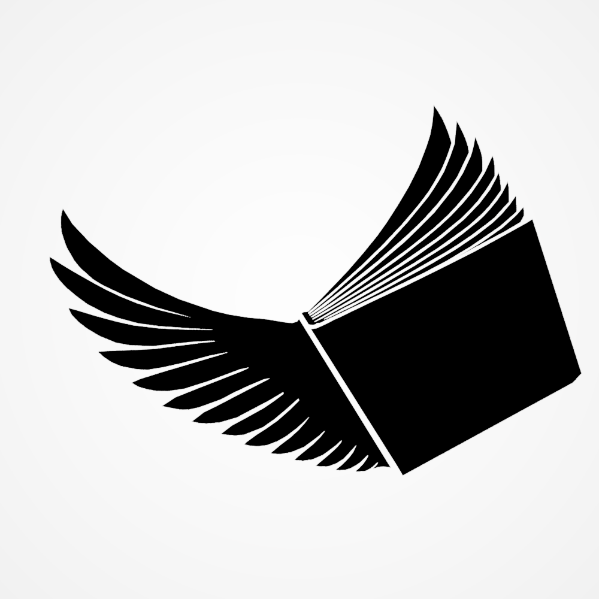
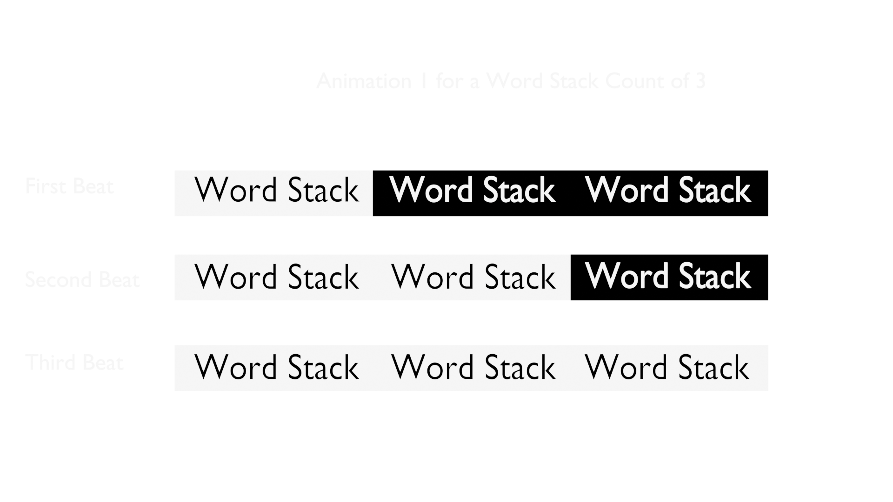
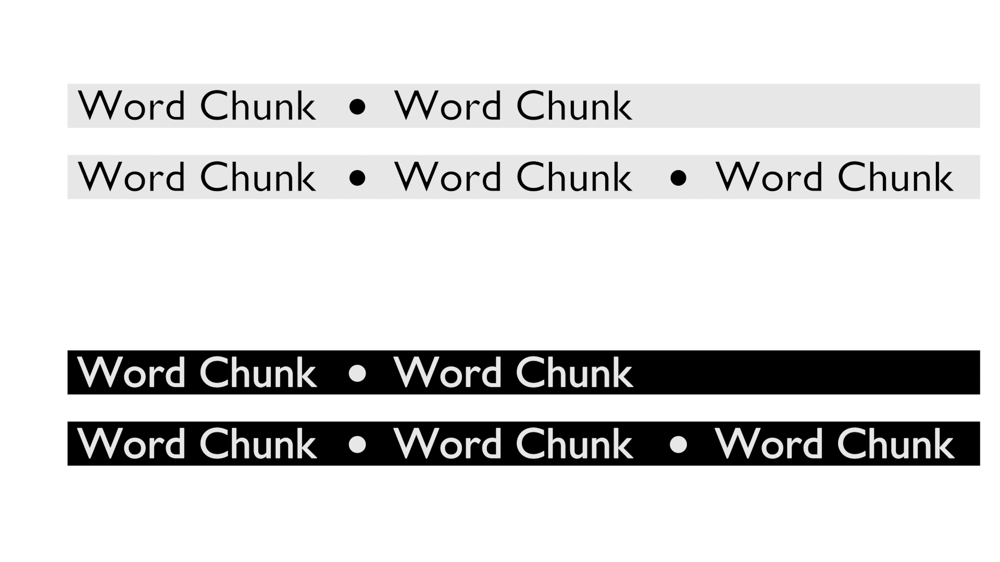

# Design Reference

This folder holds the **design-reference and source art** behind WingletReader's
interface — the working material from which the shipped UI assets were cut. It is
kept in the public repository so the visual/design side of the project is
viewable alongside the code.

> **Not build inputs.** Nothing here is imported by the application at build or
> runtime. The *shipped* assets the app actually loads live under
> [`src/renderer/src/assets/`](../src/renderer/src/assets) and
> [`resources/`](../resources). This folder is the studio; that folder is the
> product.

The canonical write-up of how these assets are used in the running UI — tokens,
roles, sprite classes — is the [Design System doc](../docs/design-system.md)
(ADR-0022).

---

## Identity

WingletReader has a **device-console identity**: flat monochrome surfaces, sharp
corners (`--radius: 0`), role-based colour (red = reading/critical, blue =
interaction, gray = neutral), and hand-drawn pixel-art sprites on interactive
affordances. The brand mark is a two-tone dove.

| | |
|---|---|
|  |  |
| Primary wordmark + dove | Brand lockup on backdrop |

The dove also appears as the app's **Home / up-level** control and as the Reader
idle mark. See [`brand/`](brand) for the full set of renders.

---

## Reading model, illustrated

The Reader displays a text as a sequence of **Stacks** — small groups of words
shown together for one beat of a tempo. These concept boards were used to design
the highlight sweep and the alternative view modes:

*Highlight sweep: the active word group is emphasised beat-by-beat across a
Word-Stack of three.*

*Chunk view variations explored during design.*

More boards: [`reader-previews/`](reader-previews).

---

## Component art

The interface is built from small sprite sets rather than an icon font. Each set
below has light/dark variants and, for hub tiles, an idle/hover pair.

| Folder | Contents |
|---|---|
| [`DesignKitReferences/`](DesignKitReferences) | The **DisplayKit** — hub tile glyphs, iconography, and the light/dark tile faces (95 files) |
| [`New Sprites/`](New%20Sprites) | Reader playback transport buttons, the slider knob, navigation/return marks, and the settings toggle |
| [`ReaderTiles/`](ReaderTiles) | The in-Reader "Browse library" toggle sprite (both states) |
| [`LibraryTilesNew/`](LibraryTilesNew) · [`SettingsTiles/`](SettingsTiles) | Library card and Settings tile explorations |
| [`LibaryFacelift/`](LibaryFacelift) · [`Layout Changes/`](Layout%20Changes) · [`BasicLayoutChanges/`](BasicLayoutChanges) | Layout iteration boards |
| [`Design Overhaul/`](Design%20Overhaul) | Written specs for the hub tiles and chrome icons |

---

## File formats

- **`.png` / `.gif`** — exported, browser-viewable. These render inline on GitHub.
- **`.pxo`** — [Pixelorama](https://orama-interactive.itch.io/pixelorama) editor
  source files, kept beside their exports for provenance. These are binary editor
  documents and will **not** preview in a browser; open them in Pixelorama.
- **`.svg`** — vector chrome-icon sources.

All art here is original to the project and covered by the repository
[LICENSE](../LICENSE).
